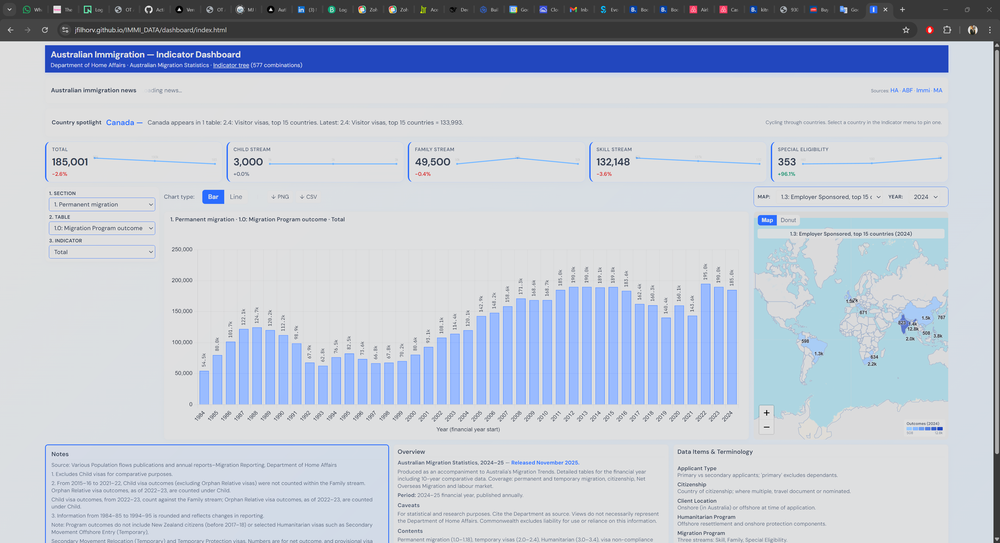
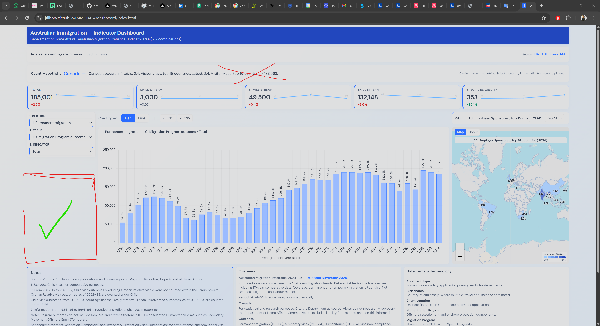

# By-country data

Summaries and aggregated data by **country** (citizenship / country of origin) from Australian migration statistics.

## Contents

| File | Description |
|------|-------------|
| `countries.json` | List of all countries with name and slug. |
| `{slug}.json` | Per country: context, Section, Table, Indicator, columns and full data (for programmatic use). |
| `{slug}.md` | Human-readable Markdown summary: tables where the country appears and main values. |

Example: **Brazil** → `brazil.json` (data) and `brazil.md` (summary).

## How to generate

From the project root:

```bash
python scripts/build_by_country.py
```

Requires `dashboard/data/indicators.csv` and `dashboard/data/tables.json` (from `scripts/build_dashboard_data.py`).
